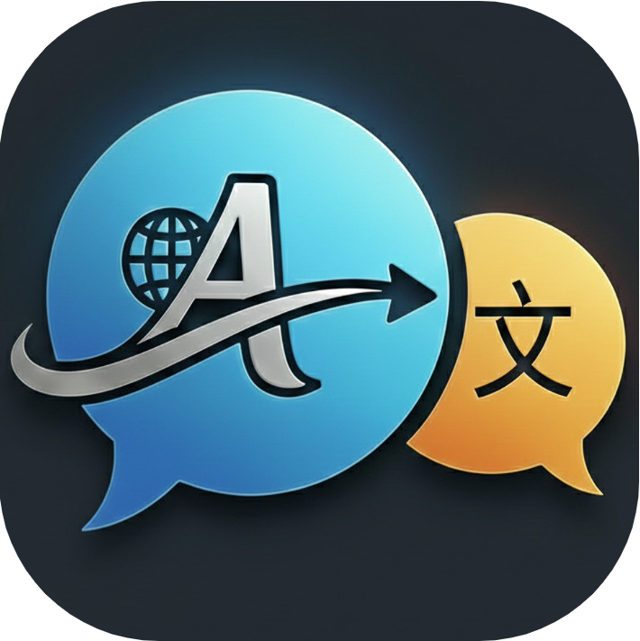
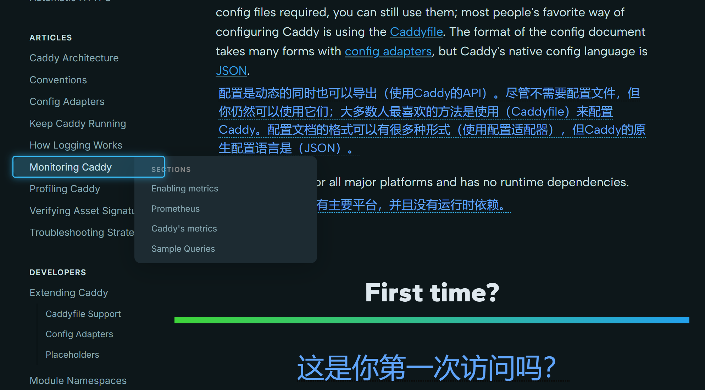
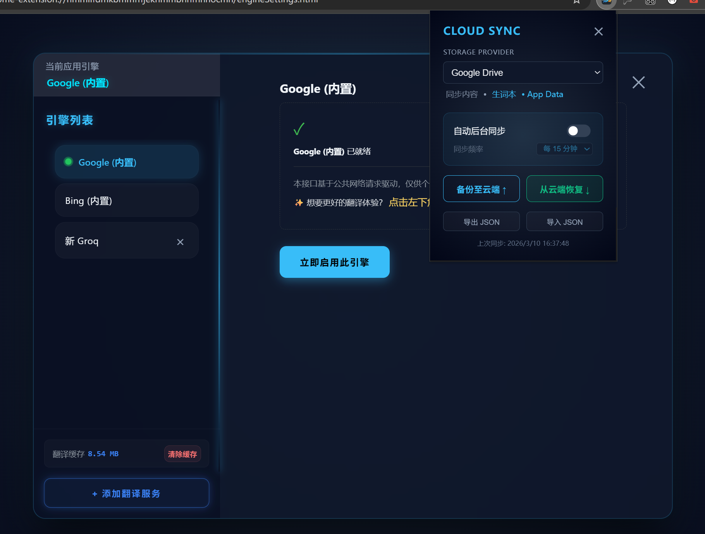

  
  <h1>Mira Translator | 米拉翻譯器</h1>

> ### **Ultra-lightweight (0.3MB) | Privacy-First | Highly Intuitive Translation Tool**
> ### **極致輕量 (0.3MB) | 隱私至上 | 高度直覺的翻譯工具**

**Mira Translator** is a translation tool that pursues ultimate aesthetics and performance. With a tiny footprint of only 0.3MB, it remains completely free, without memberships, advertisements, or any registration required.

**Mira Translator** 是一款追求極致美學與性能的翻譯工具。體積僅 0.3MB，堅持完全免費、無會員、無廣告，且無需註冊登錄。

---

## 🌟 Core Features (核心亮點)

- **Visual Element Picker (可視化拾取)**
  Precisely define translation areas with a single click for a truly "What You See Is What You Get" experience.
  通過直覺的點擊，定義網頁翻譯區域，實現「所見即所得」的定制。

- **Innovative Learning Flow (創新學習流)**
  Instant word lookup on YouTube subtitles, seamlessly synced with your Google Drive vocabulary book.
  YouTube 場景下，雙擊字幕單詞瞬間查詞並存入 Google Drive 同步的生詞本。

- **High-Quality Cache (單向借閱緩存)**
  Smartly locks high-quality AI translations to save API costs while maintaining top-tier quality.
  智能鎖定高質量 AI 翻譯結果，在節省 API 消耗的同時守住質量底線。

- **Privacy Centric (隱私至上)**
  Serverless architecture. All configurations and data are privately synced via your own Google Drive.
  無後端服務器，支持通過 Google Drive 私有雲同步配置與數據。

---

## 📸 Features & Gallery (功能圖賞)

### 1. Immersive Video Learning (沉浸式影片學習)

*Enhance your YouTube experience with elegant bilingual subtitles and instant lookup.*
*提升您的 YouTube 體驗，提供優雅的雙語字幕渲染與即時查詞功能。*

### 2. Precision Visual Picker (精準可視化拾取)

*Control your reading flow. Define translation areas on any website with one click.*
*掌控您的閱讀流。點擊即可自定義任何網頁上的翻譯區域。*

### 3. Smart Engine & Private Sync (智能引擎與私密同步)

*Powerful engine management with persistent AI cache and private Google Drive sync.*
*強大的引擎管理，具備持久化 AI 緩存與 Google Drive 私有雲同步功能。*
